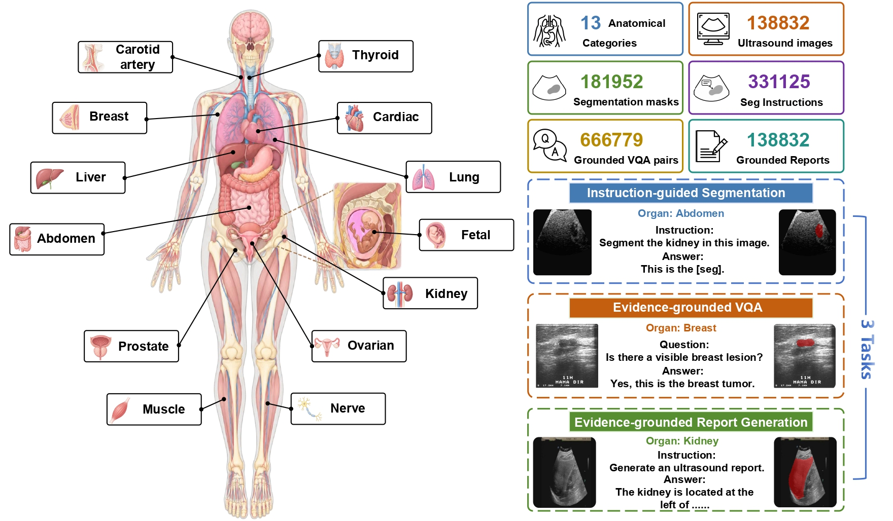
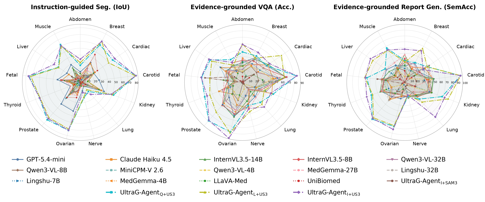

# UltraG-Bench





UltraG-Bench is a grounded ultrasound benchmark for evaluating multimodal models on three complementary tasks:

- Instruction-guided segmentation;
- Evidence-grounded visual question answering (VQA);
- Evidence-grounded report generation.

Each answer is linked to one or more segmentation masks whenever visual grounding is required. The repository also includes **UltraG-Agent**, a framework that combines an ultrasound segmentation model with a multimodal large language model (MLLM) for grounded inference.

## Source Segmentation Dataset

| Dataset                      | Paper / Source Title                                         |
| ---------------------------- | ------------------------------------------------------------ |
| `LUSS`                       | Lung ultrasound covid phantom dataset used for training machine learning model |
| `STMUS_NDA`                  | Deep learning segmentation of transverse musculoskeletal ultrasound images for neuromuscular disease assessment |
| `LUMINOUS`                   | LUMINOUS database: lumbar multifidus muscle segmentation from ultrasound images |
| `FALLMUD`                    | FALLMUD: FAscicle Lower Leg Muscle Ultrasound Dataset        |
| `AbdomenUS`                  | AbdomenUS: US Simulation and Segmentation                    |
| `OTU_2d`                     | MMOTU: A multi-modality ovarian tumor ultrasound image dataset for unsupervised cross-domain semantic segmentation |
| `OTU_3d`                     | MMOTU: A multi-modality ovarian tumor ultrasound image dataset for unsupervised cross-domain semantic segmentation |
| `EchoNet_Dynamic`            | Video-based AI for beat-to-beat assessment of cardiac function |
| `CAMUS`                      | Deep learning for segmentation using an open large-scale dataset in 2D echocardiography |
| `Unity`                      | Unity Imaging Echocardiography Datasets                      |
| `EchoCP`                     | EchoCP: An echocardiography dataset in contrast transthoracic echocardiography for patent foramen ovale diagnosis |
| `EchoNet-Pediatric`          | Video-based deep learning for automated assessment of left ventricular ejection fraction in pediatric patients |
| `CardiacUDC`                 | Graphecho: Graph-driven unsupervised domain adaptation for echocardiogram video segmentation |
| `MicroSeg`                   | Micro-ultrasound prostate segmentation dataset               |
| `RegPro`                     | MR to ultrasound registration for prostate challenge-dataset |
| `Thyroid_US_Cineclip`        | Thyroid Ultrasound Cine-clip                                 |
| `TG3K`                       | Thyroid region prior guided attention for ultrasound segmentation of thyroid nodules |
| `TN3K`                       | Multi-task learning for thyroid nodule segmentation with thyroid region prior |
| `Segthy`                     | Tracked 3D ultrasound and deep neural network-based thyroid segmentation reduce interobserver variability in thyroid volumetry |
| `DDTI`                       | An open access thyroid ultrasound image database             |
| `KFGNet`                     | Key-frame guided network for thyroid nodule recognition using ultrasound videos |
| `Annotated_Ultrasound_Liver` | Annotated Ultrasound Liver images                            |
| `Fast_UNet`                  | Fast and accurate U-net model for fetal ultrasound image segmentation |
| `ACOUSLIC`                   | ACOUSLIC-AI challenge report: Fetal abdominal circumference measurement on blind-sweep ultrasound data from low-income countries |
| `fh_ps`                      | Pubic Symphysis-Fetal Head Segmentation and Angle of Progression |
| `FASS`                       | Fetal abdominal structures segmentation dataset using ultrasonic images |
| `focus`                      | Focus: four-chamber ultrasound image dataset for fetal cardiac biometric measurement |
| `HC`                         | Automated measurement of fetal head circumference using 2D ultrasound images |
| `UPBD`                       | MallesNet: A multi-object assistance based network for brachial plexus segmentation in ultrasound images |
| `BUS_DatasetB`               | Automated breast ultrasound lesions detection using convolutional neural networks |
| `BUSI`                       | Dataset of breast ultrasound images                          |
| `BUS_BRA`                    | BUS-BRA: A breast ultrasound dataset for assessing computer-aided diagnosis systems |
| `BUS_UC`                     | Memory-efficient transformer network with feature fusion for breast tumor segmentation and classification task |
| `BUS_UCLM`                   | BUS-UCLM: Breast ultrasound lesion segmentation dataset      |
| `BrEast`                     | Curated benchmark dataset for ultrasound based breast lesion analysis |
| `BUID`                       | An open-access breast lesion ultrasound image database: Applicable in artificial intelligence studies |
| `S1`                         | Segmentation and recognition of breast ultrasound images based on an expanded U-Net |
| `CCA`                        | MI-SegNet: Mutual information-based US segmentation for unseen domain generalization |
| `Ultrasound_Normal_Kidney`   | Ultrasound Normal Kidney Image Dataset                       |
| `KidneyUS`                   | The Open Kidney Ultrasound Data Set                          |

## Repository structure

```text
UltraG-Bench/
├── annotation/          # Annotation generation and quality-checking utilities
├── datasets/            # Dataset-specific preprocessing scripts
│   └── <Domain>/Scripts/
├── grounded_datasets/   # UltraG-Bench JSONL annotations
├── evaluation/          # Model inference and benchmark evaluation
└── UltraG-Agent/        # UltraG-Agent inference and evaluation
```

## 1. Download and preprocess the original datasets

The original ultrasound images are **not redistributed in this repository**. Please download each source dataset from its official provider and follow its license and terms of use.

After downloading the data, run the corresponding conversion scripts under `datasets/<Domain>/Scripts/`. These scripts convert the original images and masks into the COCO-style layout expected by the benchmark.

Before running a conversion script, update its machine-specific input and output paths, such as `DATASET_ROOT`, `BASE_DIR`, and `OUTPUT_DIR`. For example:

```python
DATASET_ROOT = "/path/to/downloaded/TN3K"
OUTPUT_DIR = "datasets/Thyroid/Datasets/TN3K_coco"
```

```bash
python datasets/Thyroid/Scripts/convert_tn3k_to_coco.py
```

The processed data should follow this structure:

```text
datasets/<Domain>/Datasets/<dataset_name>/
├── train/
│   ├── _annotations.coco.json
│   └── <images>
└── test/
    ├── _annotations.coco.json
    └── <images>
```

Different conversion scripts require different packages, including OpenCV, NumPy, pandas, scikit-learn, pycocotools, nibabel, SimpleITK, and tqdm. Install only the dependencies required by the datasets you use.

## 2. Grounded annotation format

Each line in `grounded_datasets/*.jsonl` is one image-level record containing:

- source dataset and train/test split;
- image metadata;
- mask metadata and stable mask IDs;
- segmentation instructions with target mask IDs;
- grounded VQA pairs with evidence mask IDs;
- structured report sentences with evidence mask IDs.

The grounded annotations do not contain the original images. The `dataset`, `split`, and `image.file_name` fields are used to find each preprocessed image under the directory structure shown above.

## 3. Evaluate an OpenAI-compatible multimodal model

`evaluation/evaluate_model_api_version.py` can evaluate a multimodal model served through an OpenAI-compatible API. The evaluator reports segmentation metrics such as IoU and Dice, VQA accuracy, report-generation metrics, and grounding-aware scores.

Example for the thyroid test split:

```bash
python evaluation/evaluate_model_api_version.py \
  --grounded-root grounded_datasets \
  --organ Thyroid \
  --input grounded_datasets/thyroid_grounded_full_v1.jsonl \
  --data-root datasets/Thyroid/Datasets \
  --output-dir outputs/thyroid_internvl35 \
  --base-url http://127.0.0.1:8000/v1 \
  --api-key local-token \
  --model OpenGVLab/InternVL3_5-8B \
  --splits test \
  --workers 4
```

The evaluator writes prediction CSV files, metric CSV files, and a Markdown summary. Use `--resume` to continue an interrupted run and `--retry-errors` to rerun failed samples.

## 4. UltraG-Agent

UltraG-Agent uses [UltraSAM3](https://github.com/zhuqh19/UltraSAM3) for ultrasound grounding and an MLLM for instruction understanding and response generation.

### Environment and model services

1. Follow the UltraSAM3 repository to install its environment and obtain the configuration file and checkpoint.
2. Deploy InternVL3.5, or another vision-language model with an OpenAI-compatible chat API, using [vLLM](https://docs.vllm.ai/en/latest/serving/online_serving/).

For example:

```bash
vllm serve OpenGVLab/InternVL3_5-8B \
  --trust-remote-code \
  --host 0.0.0.0 \
  --port 8000
```

### Single-image inference

```bash
python UltraG-Agent/inference_UltraG_Agent.py \
  --image /path/to/ultrasound_image.png \
  --instruction "Where is the thyroid nodule?" \
  --sam3-code-dir /path/to/UltraSAM3/code \
  --config-path /path/to/UltraSAM3/config/config.yaml \
  --checkpoint-path /path/to/UltraSAM3_weight/UltraSAM3.pt \
  --api-url http://127.0.0.1:8000/v1 \
  --api-key local-token \
  --api-model OpenGVLab/InternVL3_5-8B \
  --output-root outputs/ultrag_agent
```

### Benchmark UltraG-Agent

```bash
python UltraG-Agent/evaluate_UltraG_Agent.py \
  --grounded-root grounded_datasets \
  --organ Thyroid \
  --input grounded_datasets/thyroid_grounded_full_v1.jsonl \
  --data-root datasets/Thyroid/Datasets \
  --output-dir outputs/ultrag_agent_thyroid \
  --agent-script UltraG-Agent/inference_UltraG_Agent.py \
  --sam3-code-dir /path/to/UltraSAM3/code \
  --config-path /path/to/UltraSAM3/config/config.yaml \
  --checkpoint-path /path/to/UltraSAM3_weight/UltraSAM3.pt \
  --api-url http://127.0.0.1:8000/v1 \
  --api-key local-token \
  --api-model OpenGVLab/InternVL3_5-8B \
  --split test \
  --workers 1
```

## Important path and security notes

- Several preprocessing and evaluation scripts currently contain machine-specific absolute paths. Replace them with paths on your system or override them through command-line arguments.
- `evaluation/run_all.sh` is an example batch launcher. Update its organ list and make it call `evaluate_model_api_version.py` before use.
- Pass `--agent-script UltraG-Agent/inference_UltraG_Agent.py` when running the current UltraG-Agent evaluator.
- Do not commit real API keys. Prefer environment variables or command-line arguments for local services.
- Start with a small run, such as `--limit-images 10`, to verify paths and API compatibility before evaluating a full domain.

